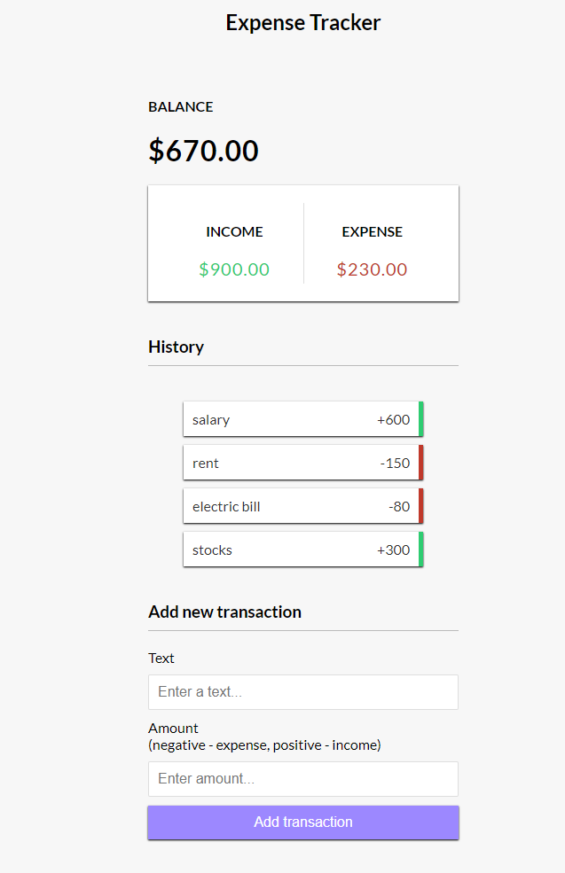

Expense Tracker
An Expense Tracker application built with HTML, CSS, and JavaScript that allows users to manage their income and expenses. The application supports adding transactions, dynamically calculating the balance, income, and expenses, and persisting the data using localStorage.

Features
Add Transactions: Record income or expenses with a description and amount.
Dynamic Updates: Automatically calculates and updates balance, income, and expense values.
Transaction History: Displays a list of all added transactions.
Delete Transactions: Remove transactions from the history.
Data Persistence: Transactions are saved using the browser's localStorage, ensuring they remain available even after refreshing the page.

Screenshots
Main Interface

**Installation**
Clone the repository:
git clone https://github.com/yourusername/expense-tracker.git

Navigate to the project folder:

cd expense-tracker

Open the index.html file in your browser to use the application.

**Technologies Used**
HTML: For structure and layout.
CSS: For styling and responsive design.
JavaScript: For interactivity and logic implementation.
localStorage: For data persistence.

**How It Works
**
Add New Transaction:
  -Enter a description (e.g., "Salary").

Enter an amount:
  -Positive values represent income.
  -Negative values represent expenses.
  -Click the "Add transaction" button to save it.

View Transaction History:
  -Transactions are displayed in a list.
  -Each transaction is marked with a green border for income and a red border for expenses.

Delete Transactions:
  -Hover over a transaction to reveal the delete button (X).
  -Click the button to remove it.
Balances & Totals:
  -The total balance, income, and expense are updated dynamically.
